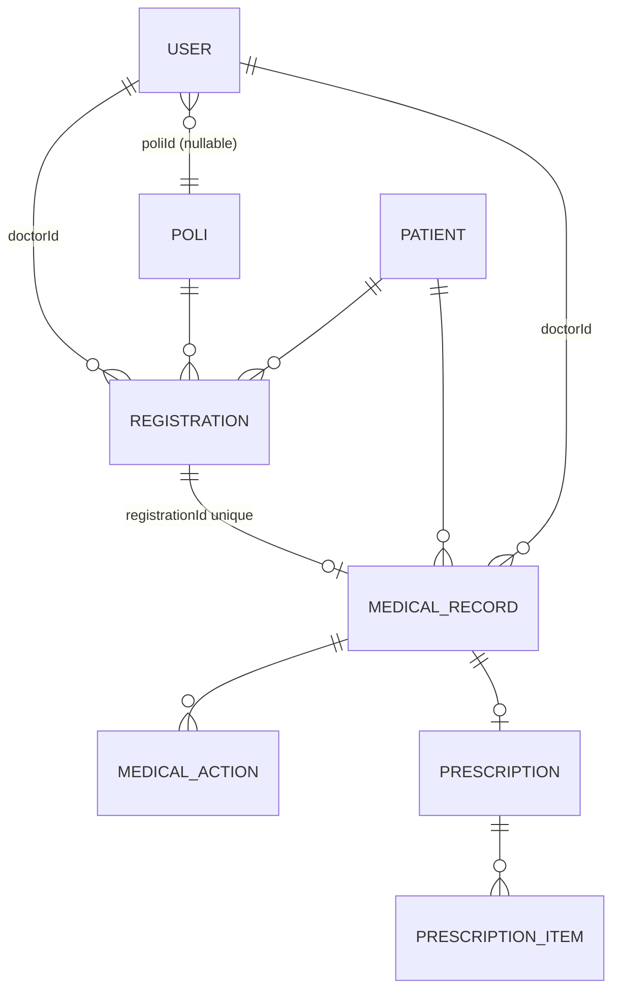

# ERD — Mini Clinic



| Table | PK | FK | Notes |
|-------|----|----|-------|
| users | id | poliId -> polis.id | role=ADMIN/DOCTOR/REGISTRATION_OFFICER |
| polis | id | - | code unique (A/B/C) |
| patients | id | - | mrn unique, nik unique |
| registrations | id | patientId, doctorId, poliId | queueNumber per poli per day |
| medical_records | id | registrationId unique | subjective/bp/temp/weight/height/diagnosis/therapy |
| medical_actions | id | medicalRecordId | name + cost |
| prescriptions | id | medicalRecordId unique | notes |
| prescription_items | id | prescriptionId | medicine/dosage/qty/instruction |
```
